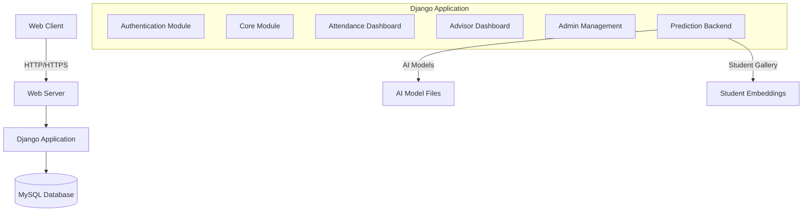
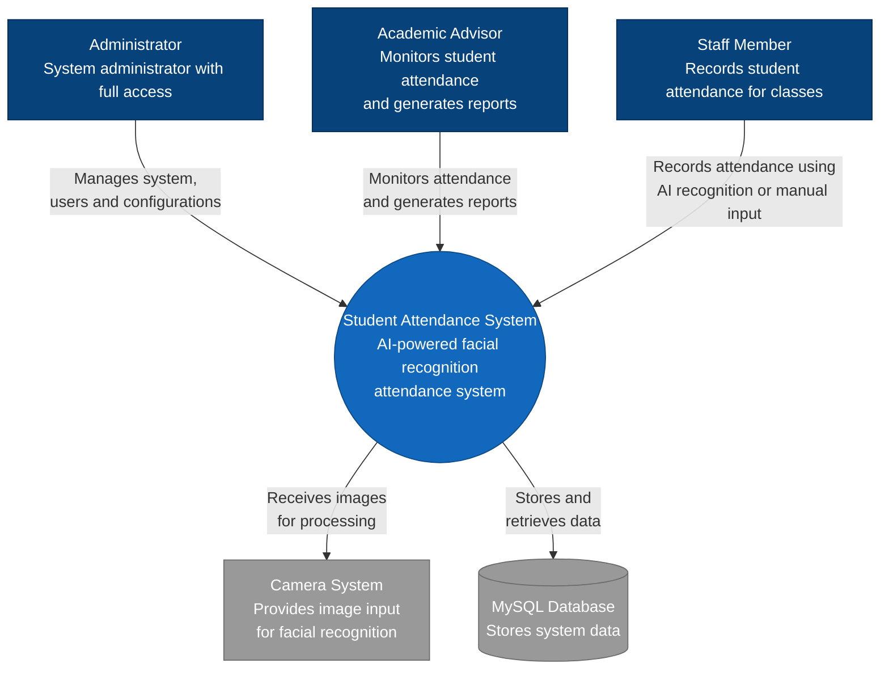
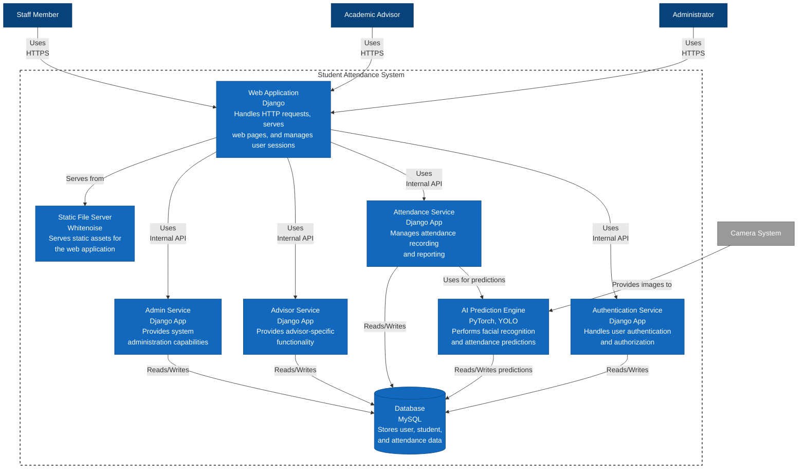
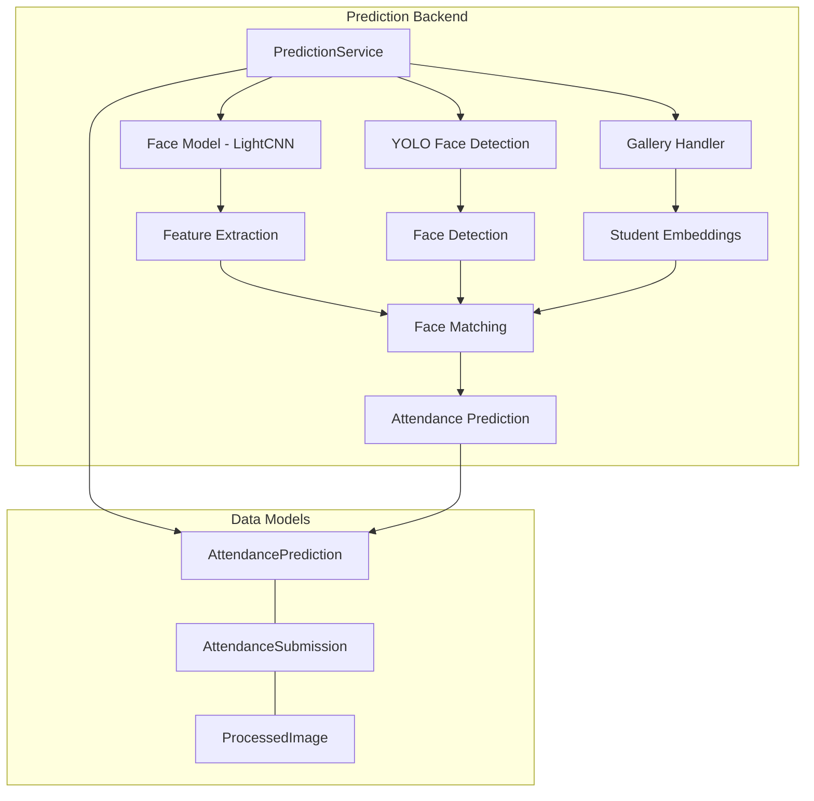
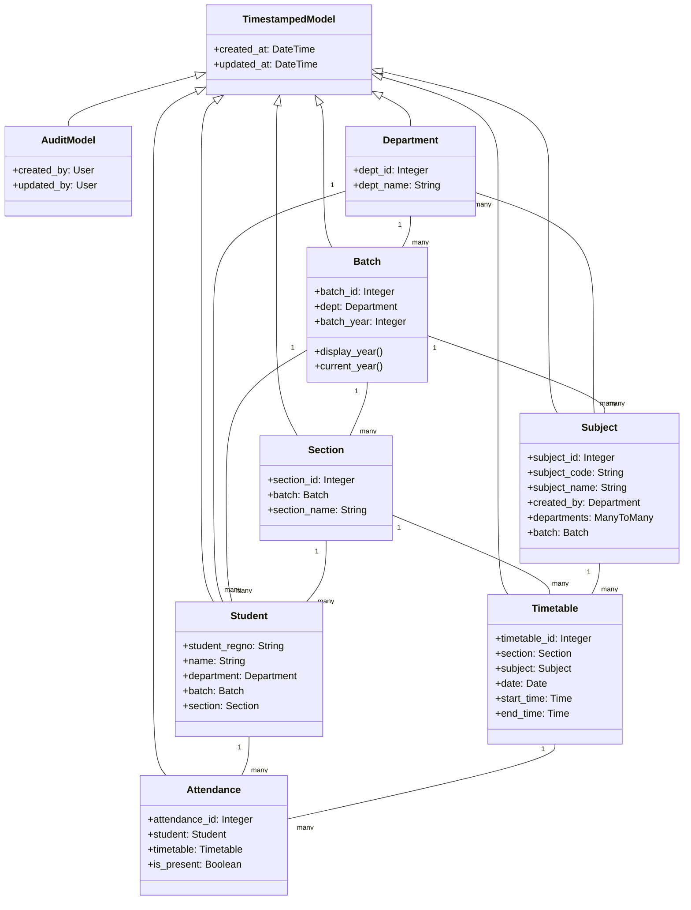
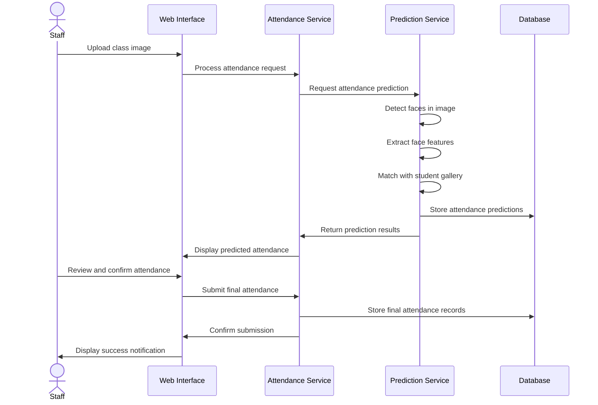
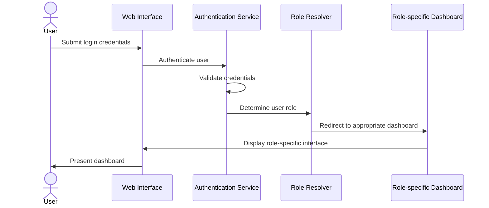

# Student Attendance System - Technical Architecture Documentation

## 1. System Architecture Overview

The Student Attendance System is a comprehensive Django-based application that leverages AI for facial recognition-based attendance tracking in educational institutions. The system follows a modular architecture with distinct components handling authentication, attendance management, advisor dashboards, and AI-powered prediction services.

### 1.1 High-Level Architecture



### 1.2 Technology Stack

- **Frontend**: HTML, CSS, JavaScript
- **Backend Framework**: Django 5.x
- **Database**: MySQL 8.x
- **AI/ML Components**:
  - PyTorch 2.x (Face Recognition - LightCNN)
  - YOLO v11 (Face Detection)
  - OpenCV 4.x (Image Processing)
- **Deployment & Operations**:
  - PM2 (Process Management)
  - Whitenoise (Static Files Serving)
  - SSL/TLS (HTTPS Support)
- **Development Tools**:
  - uv (Package Management)

### 1.3 System Components

The system is built around several key Django applications that work together to provide the complete functionality:

1. **Authentication**: User authentication and role-based redirection
2. **Core**: Central data models shared across the application
3. **Attendance Dashboard**: Interface for staff to mark and review attendance
4. **Advisor Dashboard**: Interface for academic advisors to monitor student attendance
5. **Admin Management**: Administrative functions and system management
6. **Prediction Backend**: AI-powered facial recognition and attendance prediction services

## 2. System Context Diagram



## 3. Container Diagram



## 4. Component Diagram

### 4.1 Prediction Backend Components



### 4.2 Core Data Model Components



## 5. Data Flow Diagrams

### 5.1 Attendance Marking Flow



### 5.2 User Authentication Flow



## 6. Deployment Diagram

```mermaid
graph TD
    subgraph prodServer["Production Server"]
        subgraph os["Linux Server OS"]
            subgraph webServer["Web Server"]
                djangoApp["Django Application<br/>Django 5.x<br/>(Main application server)"]
            end
  
            subgraph pm2["PM2 Process Manager"]
                aiService["AI Prediction Service<br/>Python, PyTorch, YOLO<br/>(Handles facial recognition)"]
            end
  
            subgraph dbServer["Database Server"]
                db[("MySQL Database<br/>MySQL 8.x<br/>(Stores all application data)")]
            end
  
            subgraph sslLayer["SSL/TLS Layer"]
                cert["SSL Certificate<br/>Self-signed/Let's Encrypt<br/>(Provides HTTPS encryption)"]
            end
  
            subgraph staticAssets["Static Assets"]
                whitenoiseServer["Whitenoise<br/>Django Plugin<br/>(Serves static files)"]
            end
  
            subgraph backupSystem["Backup System"]
                backupManager["Backup Manager<br/>Cron, Shell Scripts<br/>(Handles database backups)"]
            end
        end
    end
  
    djangoApp -- "Uses for predictions" --> aiService
    djangoApp -- "Stores/retrieves data" --> db
    djangoApp -- "Serves static content" --> whitenoiseServer
    cert -- "Encrypts traffic to" --> djangoApp
    backupManager -- "Backs up" --> db
  
    classDef server fill:#000,stroke:#fff,stroke-width:2px;
    classDef component fill:#000,stroke:#fd2,stroke-width:1px;
    classDef database fill:#000,stroke:#3b3,stroke-width:1px;
  
    class prodServer,os,webServer,pm2,dbServer,sslLayer,staticAssets,backupSystem server;
    class djangoApp,aiService,cert,whitenoiseServer,backupManager component;
    class db database;
```



## 7. Detailed Component Analysis

### 7.1 Authentication Module

The Authentication module handles user authentication, role-based authorization, and redirection to appropriate dashboards based on user roles.

#### Key Components:

- **Login View**: Authenticates users and redirects to appropriate dashboards
- **Role Resolver**: Determines user role based on group membership
- **Dashboard Redirector**: Redirects to role-specific dashboards

#### Key Code Elements:

```python
def get_user_redirect_url(user):
    """Determine redirect URL based on user role and group membership"""
    if user.is_superuser:
        return "admin:index"
    elif user.groups.filter(name='Advisors').exists():
        return "advisor_dashboard:dashboard"
    elif user.groups.filter(name='Staffs').exists():
        return "attendance_dashboard:attendance"  # Staff goes directly to attendance marking
    else:
        # Default for staff users without specific group
        return "attendance_dashboard:dashboard"
```

### 7.2 Core Module

The Core module contains central data models shared across the application, representing the domain entities such as departments, students, subjects, etc.

#### Key Models:

- **TimestampedModel**: Base abstract model providing timestamp fields
- **Department**: Academic departments
- **Batch**: Academic batches (year groups)
- **Section**: Sections within batches
- **Subject**: Academic subjects
- **Student**: Student information
- **Timetable**: Class timetable entries
- **Attendance**: Student attendance records

### 7.3 Attendance Dashboard

The Attendance Dashboard provides interfaces for staff to mark and review attendance, with features for both AI-powered and manual attendance marking.

#### Key Components:

- **Staff Dashboard**: Overview for staff users
- **Attendance View**: Interface for marking attendance
- **Reports View**: Interface for viewing attendance reports

### 7.4 Advisor Dashboard

The Advisor Dashboard enables academic advisors to monitor student attendance, generate reports, and manage their assigned sections.

#### Key Components:

- **Advisor Dashboard**: Overview for advisor users
- **Student Management**: Interface for managing assigned students
- **Attendance Monitoring**: Tools for monitoring student attendance

### 7.5 Prediction Backend

The Prediction Backend provides AI-powered facial recognition and attendance prediction services using deep learning models.

#### Key Components:

- **PredictionService**: Main service class handling facial recognition
- **Face Detection**: Uses YOLO to detect faces in images
- **Face Recognition**: Uses LightCNN to recognize students
- **Gallery Handler**: Manages student facial embeddings
- **AttendancePrediction**: Stores ML model predictions
- **AttendanceSubmission**: Stores final user-edited attendance submissions

#### Technical Insights:

- Uses PyTorch for deep learning models
- Implements concurrent processing with ThreadPoolExecutor
- Supports both GPU and CPU inference
- Implements robust error handling and logging

### 7.6 Admin Management

The Admin Management module provides administrative functions for system management, including server updates and monitoring.

#### Key Components:

- **Dashboard**: Admin dashboard for server management
- **Update Server**: Endpoint to update the server from git
- **Update Status**: Endpoint to check server status

## 8. Performance Considerations

### 8.1 Image Processing Performance

The facial recognition pipeline has several stages that can impact performance:

- Face detection using YOLO
- Feature extraction using LightCNN
- Matching against student gallery

Performance optimizations implemented:

- GPU acceleration when available
- Concurrent processing with ThreadPoolExecutor
- Caching of student gallery embeddings

### 8.2 Database Performance

The system uses MySQL for data storage with several performance considerations:

- Foreign key relationships are properly indexed
- Complex queries are optimized
- Connection pooling is used for efficient database connections

### 8.3 Web Interface Performance

Web interface performance is optimized through:

- Static file serving with Whitenoise (compressed static files)
- Pagination for large result sets
- Proper database query optimization

## 9. Scalability Analysis

### 9.1 Current Scalability

The current architecture supports:

- Multiple concurrent users accessing different parts of the system
- Handling of multiple attendance sessions simultaneously
- Processing of facial recognition requests in parallel

### 9.2 Scalability Limitations

Potential scalability bottlenecks:

- Single server deployment limits horizontal scaling
- AI processing is resource-intensive and may become a bottleneck with high load
- Database performance may degrade with large datasets

### 9.3 Scaling Strategies

Recommended approaches for scaling:

- **Vertical Scaling**: Increase server resources for AI processing
- **Horizontal Scaling**: Implement load balancing and multiple app servers
- **Database Optimization**: Implement sharding or read replicas for high load
- **Microservice Architecture**: Separate AI services from web services for independent scaling

## 10. Security Considerations

### 10.1 Authentication Security

- Role-based access control for different user types
- Standard Django authentication with password hashing
- Session management with secure cookies

### 10.2 Data Security

- HTTPS encryption for all traffic
- Database credentials stored in environment variables
- Sensitive data handling according to best practices

### 10.3 API Security

- CSRF protection for all POST requests
- Input validation and sanitization
- Rate limiting for sensitive endpoints

## Conclusion

The Student Attendance System is a well-structured, modular application that effectively leverages modern technologies to provide an AI-powered attendance solution. The architecture follows Django best practices with clear separation of concerns between different modules. The integration of facial recognition technology provides innovative automation while maintaining flexibility through manual attendance options.

Key architectural strengths include:

- Modular design with clear separation of concerns
- Role-based access control with specific interfaces for each user type
- Robust AI integration with fallback mechanisms
- Comprehensive data models representing the educational domain

Areas for potential enhancement:

- Moving toward a more microservice-oriented architecture for better scalability
- Implementing more advanced caching strategies for AI predictions
- Enhancing the backup and recovery capabilities for production deployment
