# Image Processing Flow Documentation

This document provides a comprehensive overview of the image flow through the face recognition model in the Student Attendance System. It explains each step from image capture to final attendance prediction results.

## 1. Overview of Image Processing Pipeline

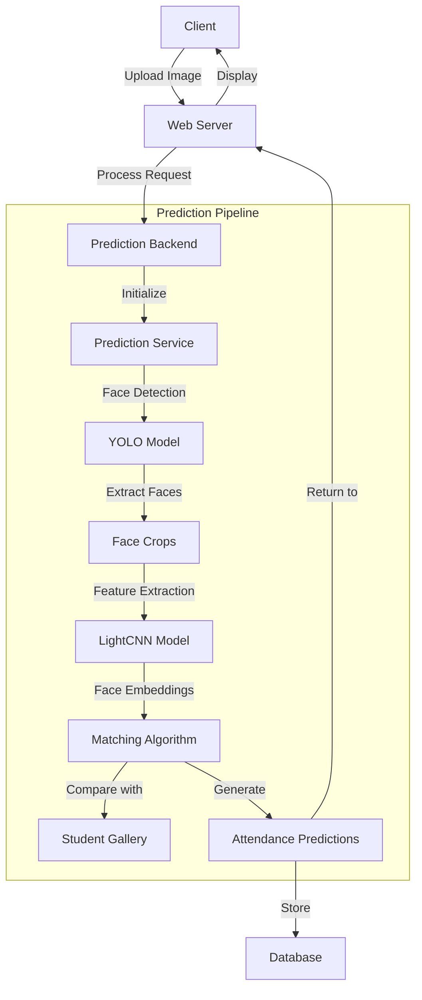

## 2. Detailed Image Processing Workflow

### 2.1 Image Upload and Session Initialization

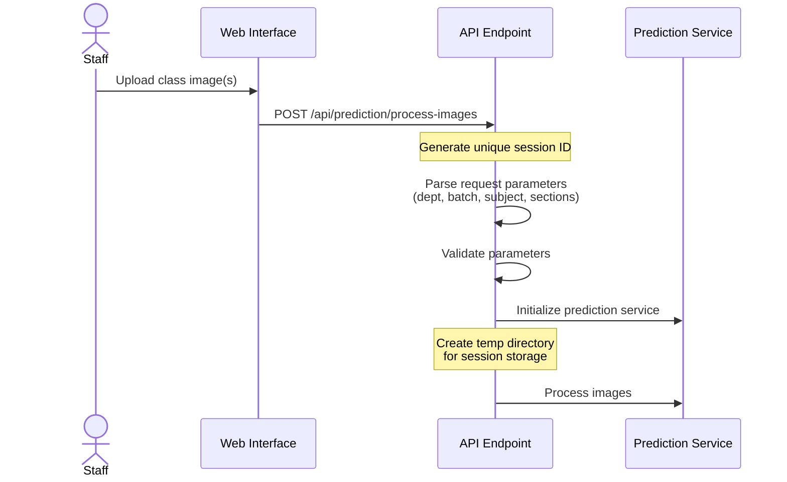

### 2.2 Face Detection Process

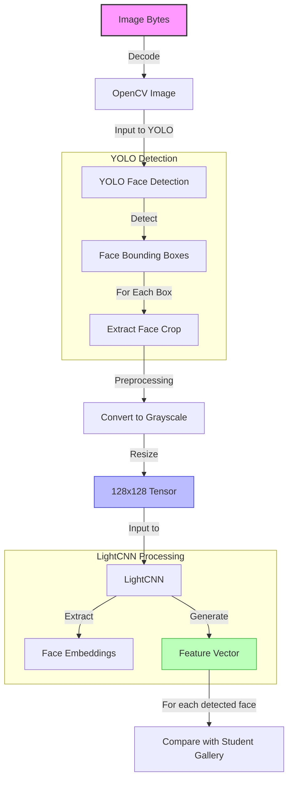

### 2.3 Gallery Matching Process

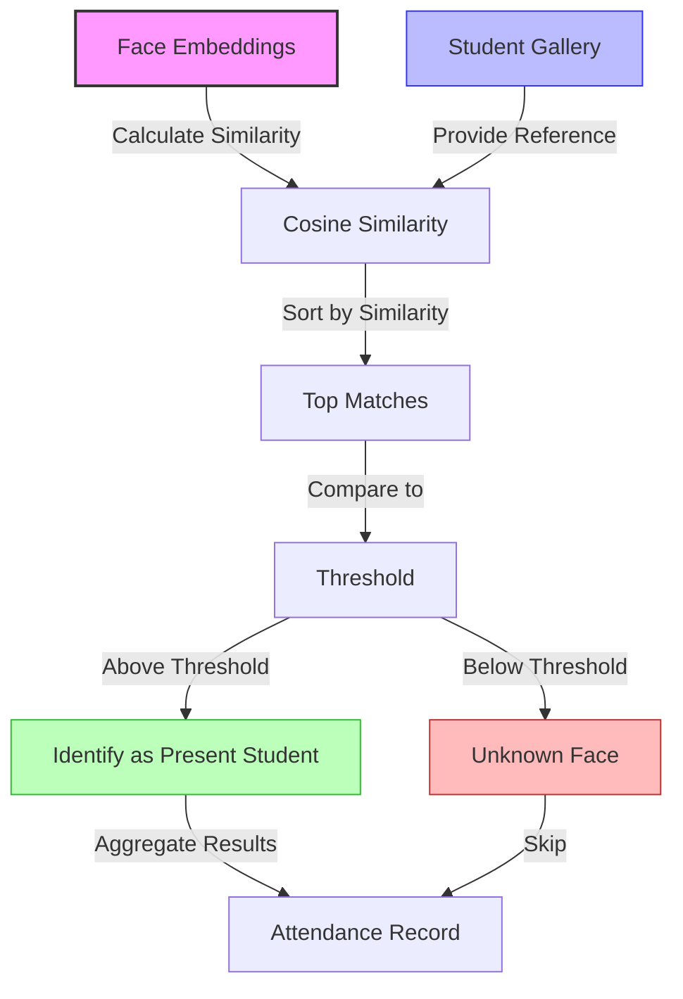

### 2.4 Multiple Image Processing

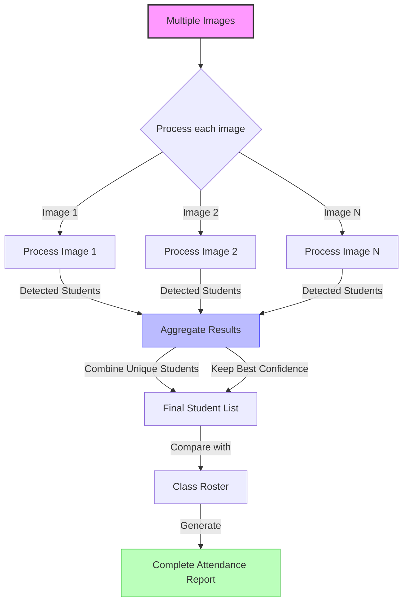

## 3. Image Preprocessing Details

### 3.1 Image Preprocessing Flow

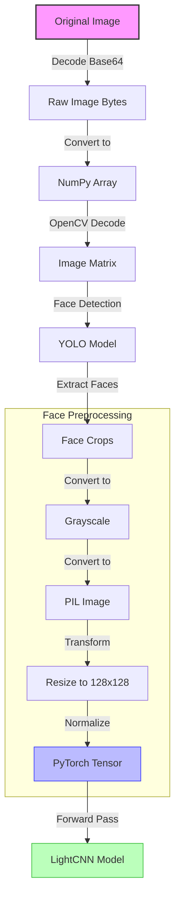

### 3.2 Processing Steps Visualization

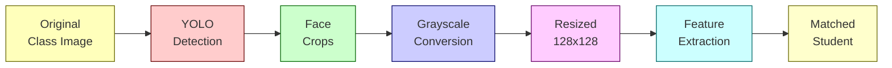

## 4. Deep Learning Models

### 4.1 Model Architecture

#### 4.1.1 YOLO Face Detection

The system uses YOLO (You Only Look Once) model for face detection:

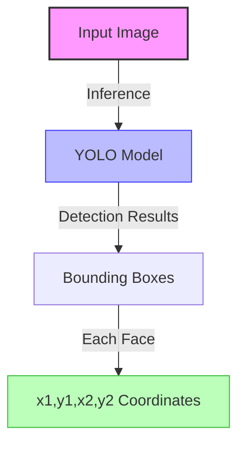

#### 4.1.2 LightCNN Feature Extraction

For face recognition, the system uses LightCNN:

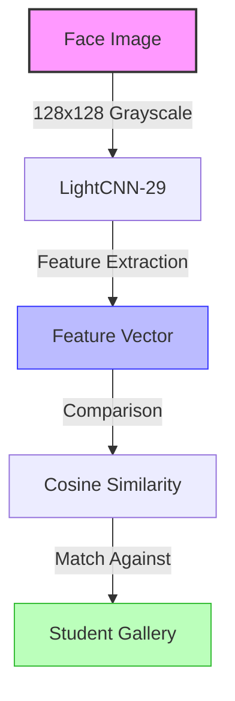

### 4.2 Gallery Management

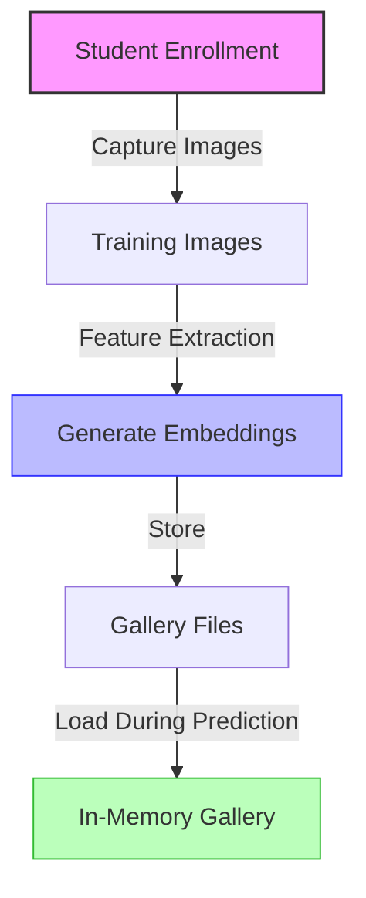

## 5. Attendance Processing Flow

### 5.1 From Prediction to Attendance Records

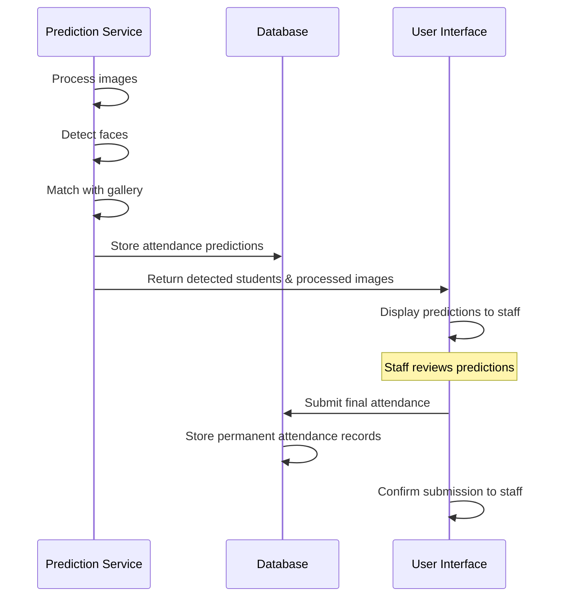

### 5.2 Handling Multiple Images

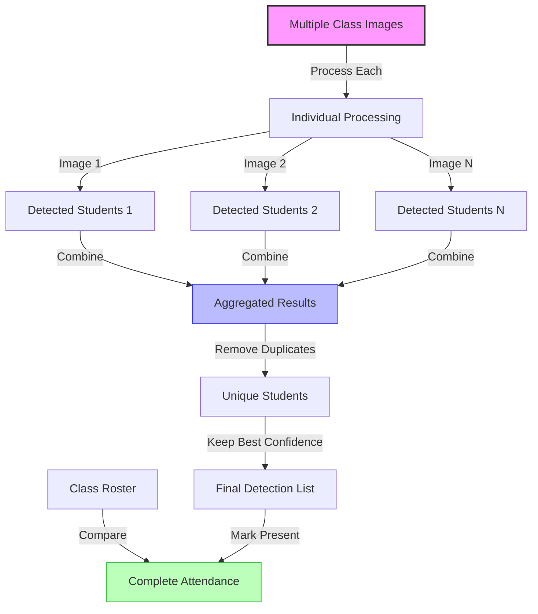

## 6. Error Handling and Fallbacks

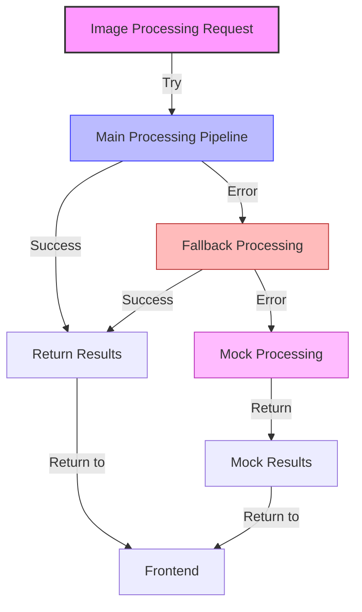

## 7. Optimization Strategies

### 7.1 Performance Optimizations

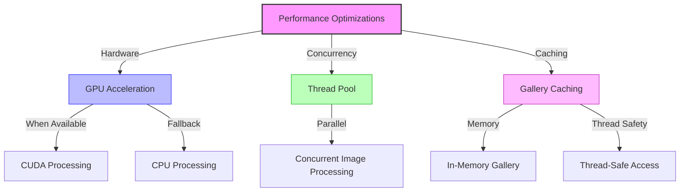

### 7.2 Resource Management

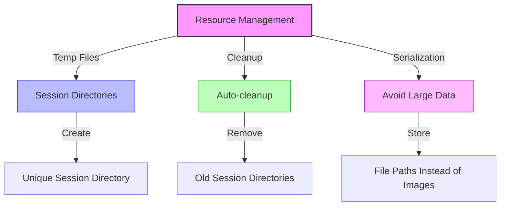

## 8. End-to-End Flow Visualization

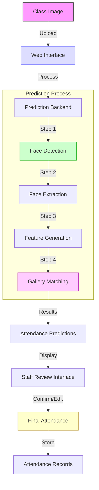

## 9. API Integration

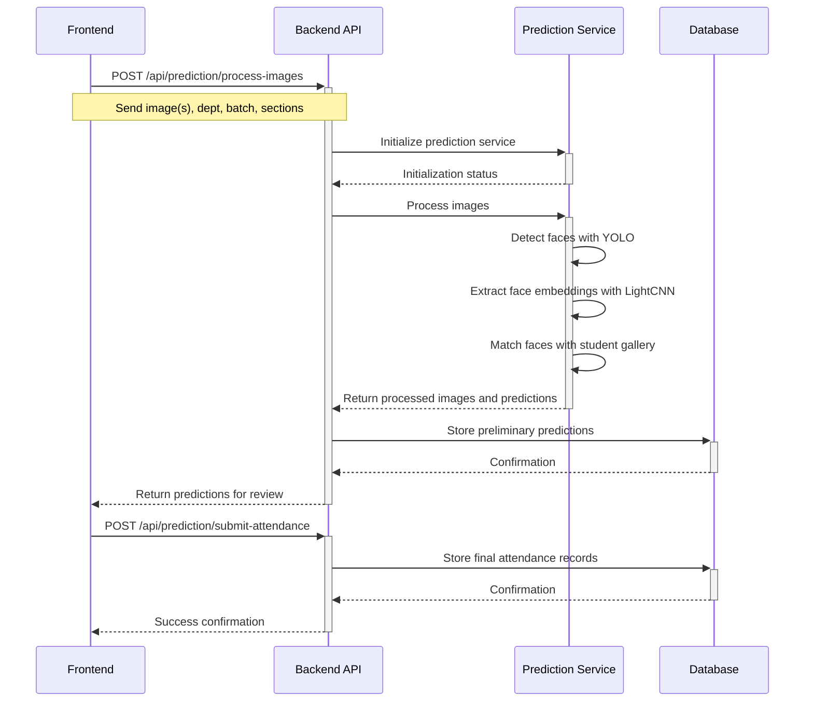

## Conclusion

This document provides a comprehensive overview of the image flow process within the Student Attendance System. The system uses a sophisticated pipeline involving YOLO for face detection and LightCNN for face recognition, combined with gallery matching to identify students in classroom images. The modular design allows for efficient processing, error handling, and optimization through techniques like concurrent processing and gallery caching.
